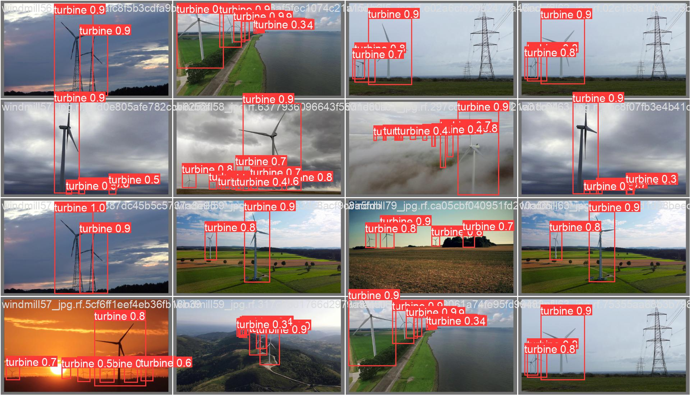

# Wind Mill Object Detection Model using YoloV8

Wind turbines are large structures that are often located in remote areas, which makes it challenging to monitor and maintain them. With the help of computer vision, it is possible to automate the detection and tracking of wind turbines in large datasets of aerial images, making maintenance and monitoring easier and more efficient.

The Wind Turbine Object Detection project aims to use computer vision techniques to detect wind turbines in aerial imagery. This project utilizes the YOLOv8 model, a state-of-the-art object detection algorithm, to accurately locate and detect wind turbines within the images or videos. The project was trained on a large dataset of labeled wind turbine images, and the resulting model has achieved **89.6% accuracy** in identifying wind turbines in new aerial images or videos.

